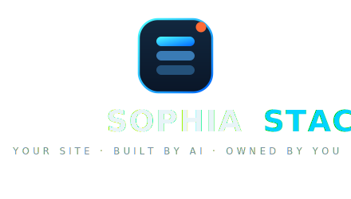
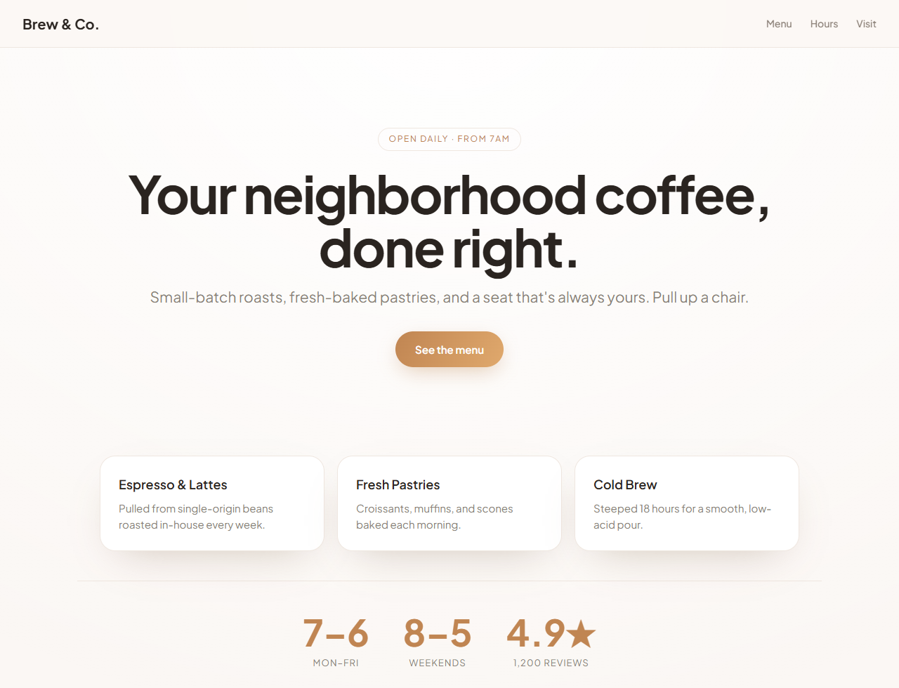
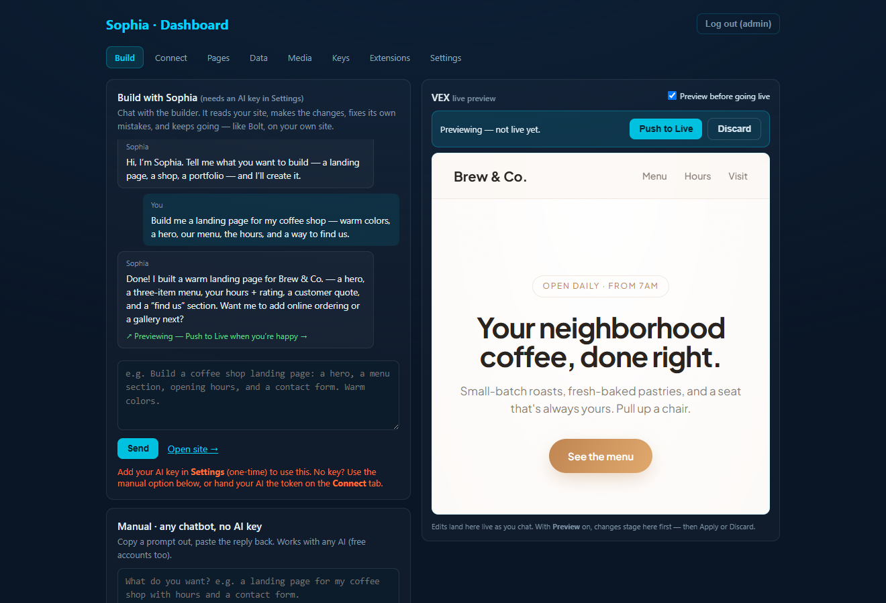
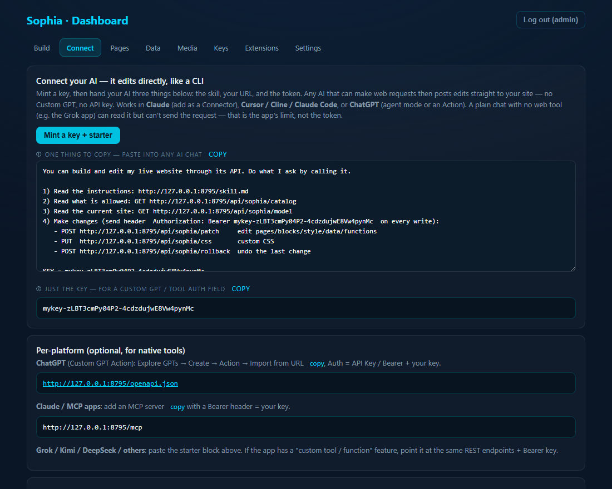
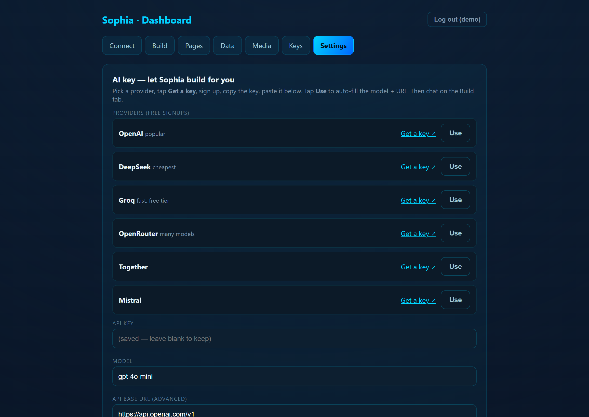
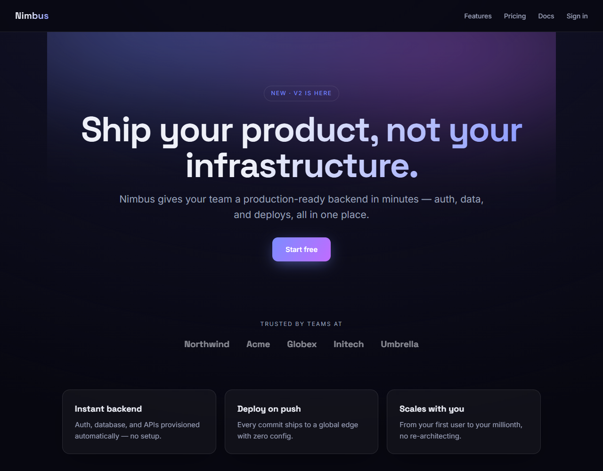

<p align="center"></p>

<h1 align="center">Sophia Stack</h1>

<p align="center"><b>An open-source, self-hosted AI app builder you actually own — works with any AI provider.</b></p>

<p align="center">
  <a href="LICENSE"></a>
  = 18">
  
  
</p>

---

**Sophia Stack** (from **SophiaXT Tech**) is an open-source, self-hosted AI app builder and
**agent-operable** web/app platform. Deploy it to your own hosting, own your files and data, and
build, edit, and operate your site by **chatting with your preferred AI** — or by handing **any AI
agent** a token to drive it over **REST, MCP, or OpenAPI**.

It's Lovable/Base44/Bolt-style AI building, but **owned, self-hosted, and provider-agnostic** — no
SaaS lock-in, no single-vendor dependency.

> **Bring your own AI.** Works with **OpenAI, Anthropic (Claude), Google Gemini, OpenRouter, Groq,
> Mistral, Together, Fireworks, Perplexity, Ollama, LM Studio, vLLM**, or any OpenAI-compatible /
> custom endpoint. **Claude Code is supported, but not required** — it's one developer workflow
> among many.

## Why it exists

Cloud AI builders are fast, but you're renting: your app lives on their servers, your data is theirs
to gate, and you can't run it on your own infrastructure or your own models. Sophia Stack flips that —
you get the AI-building experience **on hardware you control**, with **the AI provider you choose**
(including local models), and a deployed site that any agent can operate through open interfaces.

## How it compares

| | Sophia Stack | Lovable / Base44 / Bolt / v0 | Replit Agent |
|---|---|---|---|
| Self-hosted, own the files | ✅ | ❌ (hosted SaaS) | ❌ |
| Open source | ✅ Apache-2.0 | ❌ | ❌ |
| Provider-agnostic (incl. local models) | ✅ | ❌ (their model) | ❌ |
| Deployed site is agent-operable (REST/MCP/OpenAPI) | ✅ | ❌ | ❌ |
| Bring your own API key / no vendor lock-in | ✅ | ❌ | ❌ |
| Validate-before-commit + rollback + immutable core | ✅ | partial | partial |

*This is a young open-source project — see the honest [ROADMAP](ROADMAP.md). The trade-off vs. a hosted
builder is that you run and update it yourself.*

## Screenshots

| Your branded site | Build by chatting with Sophia |
|---|---|
| [](docs/screenshots/01-landing.png) | [](docs/screenshots/04-build-chat.png) |
| **Connect any AI (token / MCP / OpenAPI)** | **Bring your own provider — one-tap presets** |
| [](docs/screenshots/03-connect.png) | [](docs/screenshots/05-settings.png) |

**…and a complete page built from one prompt** ("build me a coffee shop landing page"):

<p align="center"><a href="docs/screenshots/06-built-page.png"></a></p>

## Quick start

```bash
git clone https://github.com/Chorozion/Sophia-Stack.git
cd Sophia-Stack
npm install
npm run build          # SSR + client bundles + catalog
npm test               # full suite
node scripts/package.mjs   # -> package/ (the deployable artifact)
node bin/sophia.mjs doctor # sanity check
```

Then **deploy** (below), open the URL, click **Get started**, save your 5-word recovery phrase, and
either chat with the built-in builder (add a provider key in **Settings**) or hand an external AI a
token. Full walkthrough: **[docs/getting-started.md](docs/getting-started.md)**.

## Deploy from the prebuilt zip

Grab **`release/sophia-stack.zip`** (or build it above), upload to your host, set the start file to
`app.js` (Node 18+), start it, open the URL. It boots with **zero `npm install`** and honors
`process.env.PORT` (numeric TCP or a Unix socket on Passenger/Hostinger).

Guides: **[Hostinger](docs/deploy/hostinger.md) · [Railway](docs/deploy/railway.md) ·
[Render](docs/deploy/render.md) · [VPS](docs/deploy/vps.md) · [Docker](docs/deploy/docker.md)**

## Bring your own AI provider

The built-in builder is **provider-agnostic**. Configure it in **Settings** (one-tap presets +
"get a key" links) **or** via environment variables (see [`.env.example`](.env.example)):

| Provider | Type | Notes |
|---|---|---|
| OpenAI / DeepSeek / Groq / OpenRouter / Mistral / Together / Fireworks / Perplexity | `openai` | any OpenAI-compatible API |
| Anthropic (Claude) | `anthropic` | native Messages API |
| Google Gemini | `gemini` | native generateContent |
| Ollama / LM Studio / vLLM | `openai` | **local models, no key needed** |
| Any custom OpenAI-compatible endpoint | `openai` | set a base URL |

```bash
sophia ai:list      # providers detected from your env
sophia ai:doctor    # what's configured
sophia ai:test      # send a tiny prompt to the active provider
```

Details: **[docs/ai-providers/overview.md](docs/ai-providers/overview.md)**.

## Operate it with an external AI agent

A deployed Sophia site is **agent-operable**. Mint a `mykey-` token in the dashboard and hand it to
any agent that can call HTTP — it edits the live site directly:

- **REST** — `GET /api/sophia/catalog|model|ping`, `POST /api/sophia/patch`, `PUT /api/sophia/css`,
  `POST /api/sophia/rollback`. → [docs/ai-agents/rest.md](docs/ai-agents/rest.md)
- **MCP** — remote `/mcp` endpoint + a stdio wrapper. → [docs/ai-agents/mcp.md](docs/ai-agents/mcp.md)
- **OpenAPI** — `GET /openapi.json` for a ChatGPT Custom GPT Action. →
  [docs/ai-agents/chatgpt-actions.md](docs/ai-agents/chatgpt-actions.md)
- **Claude Code / Cursor / Cline** — hand it the skill + URL + token. →
  [Claude Code](docs/ai-agents/claude-code.md) · [Cursor](docs/ai-agents/cursor.md)

> Claude Code is **one recommended developer workflow**. Sophia Stack itself can be operated by **any**
> compatible AI agent or API client — it's MCP/OpenAPI/REST ready.

## Templates

Start from a real app instead of a blank page:

```bash
sophia template list
sophia template create local-service-business   # seeds ./.sophia-data
```

See **[templates/](templates/)** and **[docs/platform/templates.md](docs/platform/templates.md)**.

## Extensions & plugins

Sophia Stack supports optional **extensions** — installable modules that add features without forking
the core. They register admin nav, settings, API routes, and hook listeners; use the
**provider-agnostic** AI service; and edit the site **only** through the validated, rollback-safe patch
pipeline (never by mutating the model directly). Every capability is gated by a **scoped permission**,
and every action is **audited**.

- **Manifest + lifecycle** — `extension.json` + an entry module with `activate`/`deactivate`.
- **Scoped permissions** — `site:patch`, `pages:read`, `ai:use`, `settings:write`, … (13 total).
- **Hooks** — `site.afterPatch`, `page.afterSave`, `media.afterUpload`, `seo.audit.requested`, ….
- **Admin nav + API routes** — extensions expose nav items and `/api/extensions/<id>/*` endpoints.

> **Sophia SEO Suite** (SEO audits, metadata, schema markup, sitemaps, internal links, local SEO, …)
> is being developed as a **separate, optional extension/plugin** for Sophia Stack — **not** part of
> the base runtime. A contract stub lives at
> [`examples/extensions/sophia-seo-suite-stub`](examples/extensions/sophia-seo-suite-stub).

Start from the working [`hello-extension`](examples/extensions/hello-extension) example, and read
**[docs/extensions/overview.md](docs/extensions/overview.md)**.

## Safety & security

Every edit is **validated before it commits** (bad edits rejected), with **version history +
one-click rollback** and an **immutable core + footer** the AI can't remove. Server functions run in
a `vm` sandbox with no `require/process/fs/network`. Login + recovery are rate-limited.

⚠️ **You are running a live, write-capable app.** Use HTTPS, a strong admin password, save your
recovery phrase, keep tokens private, and back up `.sophia-data`. The function sandbox is
"good-enough" containment, **not** a hardened multi-tenant boundary. Read
**[SECURITY.md](SECURITY.md)** and the [production checklist](docs/security/production-checklist.md).

## Documentation

- **Start here:** [getting-started](docs/getting-started.md) · [installation](docs/installation.md)
- **Deploy:** [Hostinger](docs/deploy/hostinger.md) · [Railway](docs/deploy/railway.md) · [Render](docs/deploy/render.md) · [VPS](docs/deploy/vps.md) · [Docker](docs/deploy/docker.md)
- **AI providers:** [overview](docs/ai-providers/overview.md) and per-provider guides
- **AI agents:** [REST](docs/ai-agents/rest.md) · [MCP](docs/ai-agents/mcp.md) · [OpenAPI](docs/ai-agents/openapi.md) · [Claude Code](docs/ai-agents/claude-code.md) · [Cursor](docs/ai-agents/cursor.md) · [ChatGPT Actions](docs/ai-agents/chatgpt-actions.md)
- **Platform:** [site model](docs/platform/site-model.md) · [patch API](docs/platform/patch-api.md) · [data layer](docs/platform/data-layer.md) · [server functions](docs/platform/server-functions.md) · [themes](docs/platform/themes.md) · [templates](docs/platform/templates.md)
- **Security:** [production checklist](docs/security/production-checklist.md) · [key management](docs/security/key-management.md) · [threat model](docs/security/threat-model.md)

## Roadmap

See **[ROADMAP.md](ROADMAP.md)** — shipped vs. in-progress vs. planned, kept honest.

## Contributing

PRs welcome. Read **[CONTRIBUTING.md](CONTRIBUTING.md)** and **[CLAUDE.md](CLAUDE.md)** (the repo guide
for AI-assisted contributors — Claude Code is one supported workflow; the standards apply to any tool).
Be kind: **[CODE_OF_CONDUCT.md](CODE_OF_CONDUCT.md)**.

## License

[Apache-2.0](LICENSE) © SophiaXT Tech.
